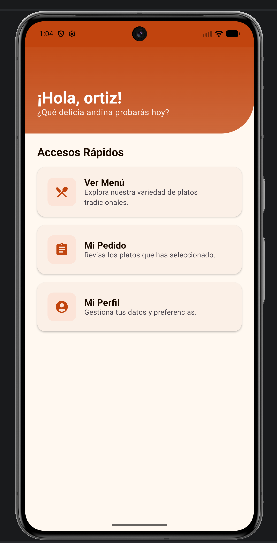
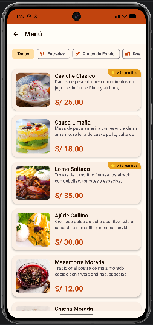

## Registro del proceso de desarrollo de nuestra aplicación Sabor Andino.

## Pantalla de Inicio de Sesión — estado inicial

## Pantalla de Inicio de Sesión — estado final

## Pantalla Principal — estado inicial

## Pantalla Principal — estado final

## Pantalla de Carta — estado inicial

## Pantalla de Carta — estado final

## Pantalla detalle de Carta - estado inicial

## Pantalla detalle de Carta - estado finalt

## Pantalla de Orden — estado inicial

## Pantalla de Orden — estado final

## Pantalla de Usuario — estado inicial

## Pantalla de Usuario — estado final

## prompt
Animaciones de transición:
Actúa como un consultor senior de Android. Quiero agregar animaciones de transición entre pantallas en mi app Kotlin + Jetpack Compose usando accompanist-navigation-animation. Implementa un NavGraph con AnimatedNavHost donde:
- La pantalla "menu" entre con slideInHorizontally desde la derecha y salga hacia la izquierda
- La pantalla "detalle/{platoId}" entre desde la derecha y al hacer back salga hacia la derecha
- La pantalla "carrito" use fadeIn y fadeOut
Muéstrame el código completo de NavGraph.kt con las dependencias necesarias en build.gradle.

Card con badge "Más vendido" / "Nuevo":
Actúa como un diseñador UI senior en Jetpack Compose. Crea un composable PlatoCard para una app de restaurante llamada "Sabor Andino" que muestre:
- Imagen a la izquierda con clip redondeado solo en las esquinas izquierdas
- Badge superpuesto en la imagen que diga " Más vendido" en color secondary (dorado) o " Nuevo" en color tertiary (verde), según un parámetro booleano
- Nombre del plato en titleMedium SemiBold
- Descripción en bodySmall con máximo 2 líneas
- Precio en formato "S/ 00.00" en primary color Bold
Usa Material 3, RoundedCornerShape(16.dp) y CardDefaults con elevación de 3.dp.

 Estado vacío del carrito:
Actúa como un experto en UX y Jetpack Compose. Crea un composable CarritoVacio para cuando el carrito de pedidos esté sin items. Debe incluir:
- Un ícono de carrito de compras dentro de un círculo con fondo primaryContainer al 40% de opacidad
- Animación de escala con spring (DampingRatioMediumBouncy) al aparecer
- Animación de pulso infinita en el ícono (alpha entre 0.6 y 1.0 con tween de 1000ms)
- Texto principal "Tu pedido está vacío" en titleLarge SemiBold
- Subtexto motivacional centrado en bodyMedium con onSurfaceVariant
- Botón "Ver el menú" con ícono Restaurant, ancho del 70% y altura 48.dp
El composable recibe un lambda onVerMenu: () -> Unit para navegar al menú.
