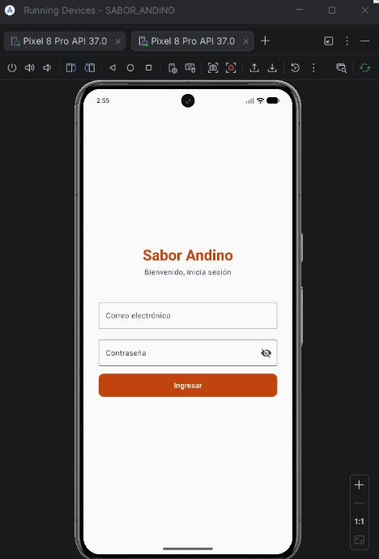
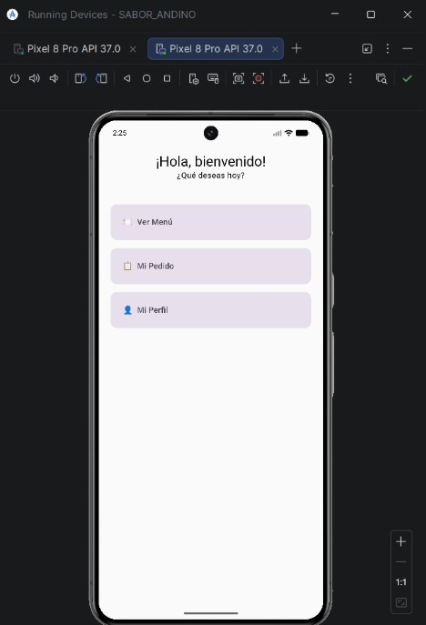
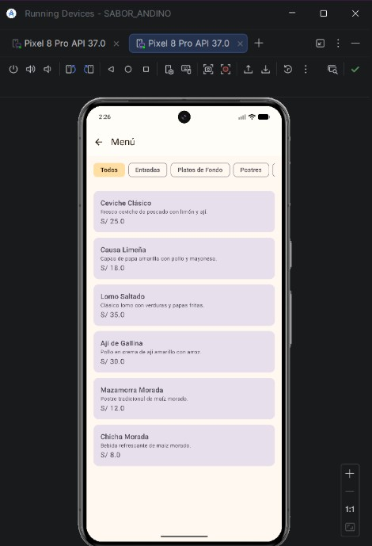
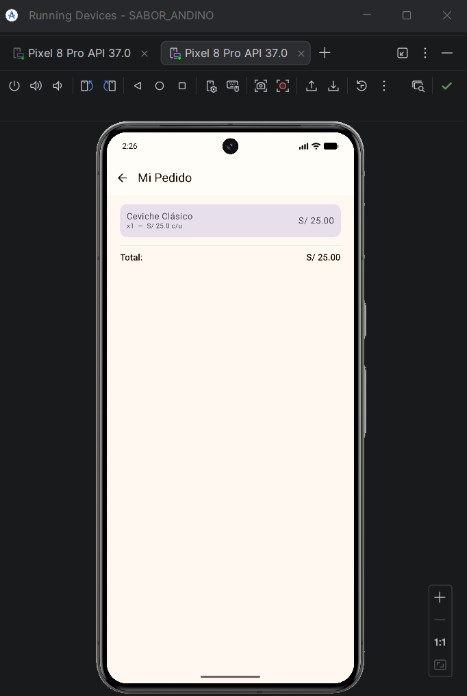
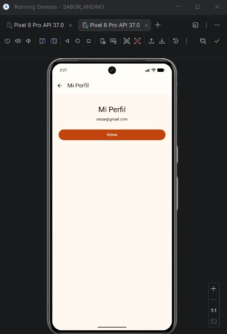

## Registro del proceso de desarrollo de nuestra aplicación Sabor Andino.

## Pantalla de Inicio de Sesión — estado inicial

## Pantalla de Inicio de Sesión — estado final
# promp

## Pantalla Principal — estado inicial

## Pantalla Principal — estado final
# promp

## Pantalla de Carta — estado inicial

## Pantalla de Carta — estado final
# promp

## Pantalla detalle de Carta - estado inicial

## Pantalla detalle de Carta - estado final
# promp

## Pantalla de Orden — estado inicial

## Pantalla de Orden — estado final
# promp

## Pantalla de Usuario — estado inicial

## Pantalla de Usuario — estado final
# promp
